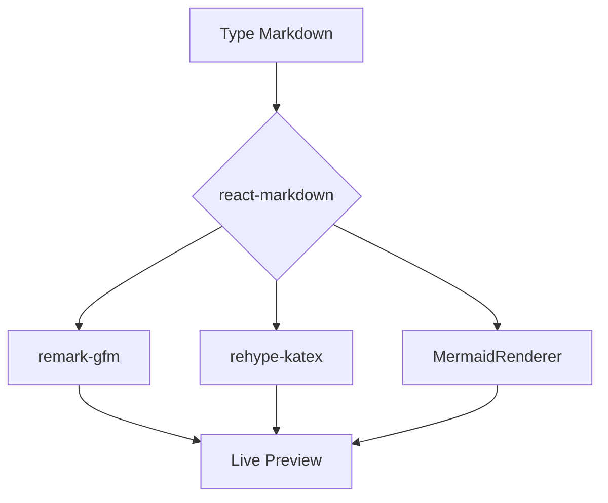

# Welcome to Markdown Viewer

This is a developer-focused, feature-rich Markdown editor and previewer. Below is a guide to everything you can do!

---

## 1. Basic Formatting
You can format text in **bold**, *italics*, or ~~strikethrough~~.
* Use asterisks for **bold** or *italic*.
* Use tildes for ~~strikethrough~~.

## 2. Lists & Task Lists
You can easily create bulleted, numbered, and task lists:

* [x] Finish the UI polish
* [ ] Review this landing page content
* [ ] Implement the content

1. First ordered item
2. Second ordered item

## 3. Blockquotes
> "Markdown is a lightweight markup language with plain-text-formatting syntax."
> — *John Gruber*

## 4. Code Blocks & Syntax Highlighting
We support powerful inline `code` and multi-line syntax highlighting:

```javascript
function greet(name) {
  console.log(`Hello, ${name}! Welcome to the viewer.`);
}
greet('Developer');
```

## 5. Tables
GitHub-Flavored Markdown tables are supported out of the box:

| Feature | Supported | Description |
| :--- | :---: | :--- |
| **GFM** | ✅ | Task lists, tables, strikethrough |
| **Math** | ✅ | KaTeX rendering |
| **Diagrams**| ✅ | Mermaid chart rendering |

## 6. Advanced: Math Equations (KaTeX)
Write complex mathematical formulas using `$…$` for inline math like $E = mc^2$, or `$$…$$` for block equations:

$$
f(x) = \int_{-\infty}^\infty\hat f(\xi)\,e^{2 \pi i \xi x}\,d\xi
$$

## 7. Advanced: Mermaid Diagrams
To render diagrams, use a code block and specify `mermaid` as the language:



## 8. Print Perfect
Switch to **Read** mode in the navigation bar and hit the **Print** icon. The app is deeply optimized with `@media print` rules to strip away UI elements and prevent awkward page breaks inside code blocks, tables, and images. Perfect for generating gorgeous developer documentation PDFs!
